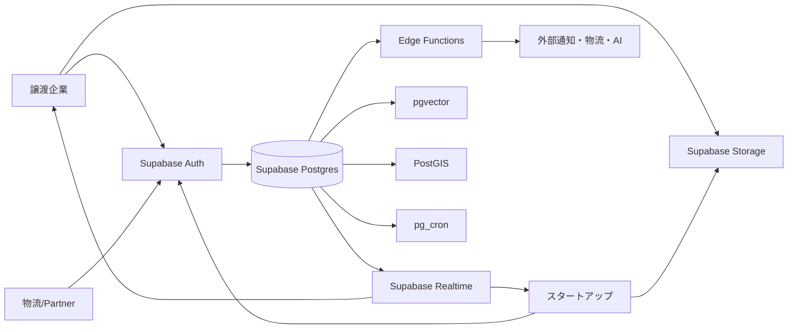
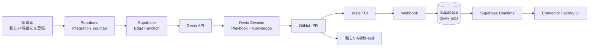

# AIAU Craft Day スポンサー賞攻略調査報告 — スタートアップ向け「オフィス資産リレー」構想

## エグゼクティブサマリー

**結論から言うと、今回もっとも勝ちやすい形は、単なる「中古家具のマッチングアプリ」ではありません。**

提案するプロダクト像は、仮称 **「OFFICE RELAY」**。  
「引越し・縮小・入替えで数日後に不要になるオフィス資産」を、**廃棄される前に、創業直後のスタートアップへ直接リレーするB2B循環プラットフォーム**です。

さらに、

> **家具の需要 × 距離 × 引渡期限 × スタートアップが提供できるサービス**

を同時にマッチングします。

例えば、

- A社：「48時間以内にデスク20台を搬出したい」
- スタートアップB：「デスク10台欲しい」
- A社：「代わりにAI研修をしてほしい」
- B社：「AI研修を提供可能」

という **「物品＋サービスの双方向マッチング」** にします。

ここにSupabaseを単なるDBとしてではなく、**マッチングエンジンそのもの**として使います。`Postgres + pgvector + PostGIS + RLS + Storage + Realtime + Edge Functions + cron` をユーザー価値に直結させます。SupabaseはフルPostgresを中核にAuth、Storage、Realtime、Edge Functionsが統合され、pgvector、PostGIS、pg_cronなどの拡張も利用できます。citeturn38search14turn38search1turn38search2

そしてCognition/Devinについては、さらに一段攻めます。

**「Devinでこのアプリを作りました」だけでは弱いです。**

今回の“え？”を狙う案は、

> **新しい家具供給会社を追加すると、Devin自身がその会社向けデータ連携コネクタを開発し、テストし、GitHub PRを作り、その進捗がSupabase Realtimeで管理画面に流れてくる。**

という **自律拡張型マーケットプレイス** です。

Devinは現在、APIからセッションを作成してアプリケーションやワークフローへ組み込め、service user/RBAC、Managed Devinsによる並列作業、Playbooks、Knowledge、Automations、公式MCPなどを提供しています。したがって、これはデモ用の“無理矢理な使い方”ではなく、Devinの現在の製品設計に沿った高度な使用です。citeturn39search2turn39search1turn39search4turn39search11

この戦略が特に有利な理由は、今回の最終審査100点のうち、**スポンサーサービス活用度25点＋完成度25点＝50点**だからです。残る独創性20点、課題解決・インパクト15点、プレゼン15点にも、「双方向マッチング」と「Devinによる供給網の自律拡張」は同時に効きます。citeturn8search0turn7search0turn9search0

| 審査軸 | 配点 | OFFICE RELAYで狙う回答 |
|---|---:|---|
| Supabase・Devin活用 | **25** | Supabaseを事業ロジックの中心、Devinを供給網拡張エージェントにする |
| 完成度・動作 | **25** | 「出品→マッチ→承諾→引渡完了」の一本を確実に動かす |
| アイデア・独創性 | **20** | 家具だけでなく「相手企業が欲しいサービス」までマッチ |
| 課題解決・インパクト | **15** | スタートアップ初期投資と企業の撤去・廃棄問題を同時解決 |
| プレゼン | **15** | Realtimeマッチ発生→Devin Connector Factoryの二段“wow” |

**最重要判断は、機能数を増やし過ぎないことです。**

2人チームなら、決済、実物流API、広告配信、人材紹介、複雑なチャットまで完成させるより、

**①余剰品登録  
②スタートアップの欲しい物＋提供サービス登録  
③高品質な双方向マッチング  
④承諾・引渡し  
⑤Realtime  
⑥Devinによる新規供給元コネクタ生成**

の6つを完璧に見せる方が、審査構造上はるかに合理的です。これはスポンサー利用25点と完成度25点の両方を守るためです。citeturn8search0turn7search0


## イベントページから読み取れる審査・提出・制約

イベントは **2026年8月14日（金）〜8月16日（日）の3日間**で、SupabaseとDevinを活用してプロダクトをローンチするAIAU Craft Dayです。Supabase側のイベント情報にも「Supabase × Devin Hackathon Tokyo - AIAU Craft Day」と掲載されています。citeturn0search0turn0search6

なお、ユーザー記載の「Devin Supabase」「Devin Spabese」は一つのサービス名ではなく、今回のイベントでは **Supabase** と **CognitionのDevin** が別々のスポンサーサービスです。イベントにはそれぞれ **Supabase賞** と **Cognition賞** が存在します。citeturn32search0

### 審査基準

検索インデックスからイベントページの各審査項目を照合すると、最終発表は次の**100点満点**です。

| 評価項目 | 点数 | 今回の攻略方針 |
|---|---:|---|
| Supabase・Devinの活用 | **25点** | 両方を製品の中核へ |
| 完成度・動作 | **25点** | Golden Pathを絶対に壊さない |
| アイデア・独創性 | **20点** | 双方向サービス交換＋Connector Factory |
| 課題解決・インパクト | **15点** | 創業コスト、廃棄、物流、ESGの複数課題 |
| プレゼンテーション | **15点** | Before→Match→Live→Devin→Business |
| **合計** | **100点** | |

Supabase・Devin活用25点と完成度25点はイベントページに明記され、アイデア・独創性20点、課題解決・インパクト15点、プレゼン15点を合わせて100点です。citeturn6search0turn7search0turn8search0turn9search0

ここから重要な戦略的示唆があります。

**「Supabaseの機能をたくさん使った」ではなく、「Supabaseだから成立する体験」を見せること。**

同じくDevinも、

**「Devinにコードを書いてもらいました」→弱い  
「Devinがプロダクトの供給網そのものを増殖させます」→強い**

と考えるべきです。

過去のSupabase公式ハッカソンでも「Supabaseを深く一機能使うこと」または幅広く使うことの双方が評価対象とされていました。これは今回の審査基準そのものではありませんが、Supabase側が“意味のある技術活用”を見る際の参考シグナルにはなります。citeturn4search4

### 最終選考と提出物

最終発表に進めるのは**予選を通過した10チーム**です。通過しなかったチームについても、時間が許せば懇親会中などに発表機会が設けられる旨がイベントページにあります。citeturn17search0turn36search0

最終日の成果物提出は **Google Form**。イベントページの検索インデックスから確認できる項目には、

- プロジェクト名
- プロジェクト説明
- 添付資料
- GitHub URL等

が含まれます。GitHub URL等についてはフォーム項目として案内されています。citeturn26search0turn36search0

**注意点として、Google Formの厳密な締切時刻までは、今回取得できた検索インデックスから確認できませんでした。** connpass本体は現在bot確認画面になり、本文を直接取得できません。したがって、フォームの締切時刻だけは**会場・Discord/Slack等の参加者向け案内を最優先**してください。citeturn34view0

### 最終日の重要時刻

現在検索できるイベントページでは、8月16日（日）は開発・発表日で、

| 時刻 | 内容 |
|---|---|
| **15:10** | ファイナリスト最終発表 |
| **17:00** | 審査・休憩 |
| **17:30** | 結果発表・表彰 |
| **18:00** | 懇親会・希望チームの任意発表 |

となっています。citeturn35search0

イベントページにはスケジュール等が変更される可能性も示されているため、当日の運営案内を優先すべきです。citeturn10search0

つまり**2026年8月15日現在は「機能を増やす日」ではなく、勝てる一本に絞り込む日**です。

### 表彰

イベントページで確認できる賞は、

**最優秀賞 / Supabase賞 / Cognition賞 / オーディエンス賞**

です。citeturn32search0

そこで今回私は、最優秀賞を狙いつつ、実装構造としては、

**Supabase賞とCognition賞の“二冠を狙える説明”**

に寄せるのが良いと判断します。


## プロダクト戦略 — 「中古家具市場」ではなく48時間オフィス資産レスキュー

### 問題設定を変える

単純に、

> 不要な家具を出品 → 欲しい人がもらう

だけではジモティー等との差が薄くなります。

海外の先行サービスを調査すると、成功している循環型サービスは単なる掲示板ではありません。

Green Standardsは企業のオフィス退去・再構成時に家具、什器、設備を**再販・寄付・移設・リサイクル**へ振り分けるオフィスdecommissioningを提供しています。citeturn40search0turn40search12

Rheaplyは組織の余剰家具・什器・設備を掲載し、別組織が再利用するresource exchangeを提供しています。Ellen MacArthur Foundationも、Rheaplyを家具・什器・設備・建材を再流通させる事例として紹介しています。citeturn40search1turn40search13

RESEATは、**オフィス移転の数か月前から家具を掲載**し、家具をライフサイクル単位で管理する設計です。citeturn40search3

Globechainは企業の不要物を非営利団体、中小企業、個人等へ再流通させ、ESG情報まで扱うreuse marketplaceです。citeturn40search2turn40search22

この世界事例から得られる答えは、

> **「家具を探すサービス」ではなく、「退去期限までに次の持ち主を決めるサービス」にする。**

です。

そこでプロダクトの一番上に置くKPIを、

**「掲載件数」ではなく  
`Rescue before deadline` = 撤去期限までに再利用先を確定した資産数**

にします。

これはプレゼンで非常に強いです。

### 最大の独自性 — 「物品 × サービス」の双方向マッチ

ユーザーのアイデアにある、

> 譲ってもらったスタートアップが自社サービスを提供する

は、今回の企画の中で非常に価値があります。

これを単なるポイント交換ではなく、

**Reciprocal Capability Matching**

として前面に出します。

例えば譲渡企業側が、

> 「デスク20台無料。代わりに採用LPを作ってほしい」

と登録。

スタートアップ側が、

> 「デスク10台必要。Web制作・AI研修を提供できる」

と登録。

システムが、

> **物品適合 97%  
> サービス適合 91%  
> 距離 4.2km  
> 引渡期限 26時間  
> 総合 94% MATCH**

と出します。

これは普通のリユース市場にはないストーリーになります。

### 推奨マッチング式

ハッカソン版では、説明できることを重視して以下で十分です。

\[
Score =
0.35 AssetFit
+0.20 ServiceFit
+0.20 GeoFit
+0.15 UrgencyFit
+0.10 TrustFit
\]

| 要素 | 方法 | Supabase |
|---|---|---|
| AssetFit | 欲しい物と出品説明の意味類似度 | pgvector |
| ServiceFit | 譲渡側が欲しいサービスと受取側の提供サービスの類似度 | pgvector |
| GeoFit | 位置・配送距離 | PostGIS |
| UrgencyFit | 引取可能日時 vs 撤去期限 | PostgreSQL |
| TrustFit | 本人確認・過去取引等 | PostgreSQL |

pgvectorはPostgres上でembeddingを保存・検索でき、Supabaseはsemantic searchやkeyword＋semanticのhybrid searchを公式にサポートしています。citeturn38search9turn38search5

PostGISを使えば位置順の並べ替えや特定範囲内の検索をPostgres上で行えます。citeturn38search2

つまり**マッチングアルゴリズム全体をSupabase PostgreSQL上で表現できる**ため、スポンサーへの説明が非常に美しいです。

### 供給元をどこから集めるか

最初のターゲットがスタートアップなら、実は**需要側より供給側の獲得設計が重要**です。

推奨優先度は以下です。

| 供給元候補 | 主な物品 | 引渡し | データ連携 | 長所 | 注意点 | 優先 |
|---|---|---|---|---|---|---|
| オフィス退去・移転企業 | デスク、椅子、棚、モニター | 直接引取/配送 | Form、CSV、Webhook | 大量・期限が明確 | 短納期 | **A** |
| 引越し・移転会社 | あらゆる什器 | 紹介→直接 | CSV/パートナー連携 | 不要品発生を最速で知る | 本人が所有者ではない | **A** |
| オフィス家具買取業者 | 家具、OA機器 | 倉庫/配送 | CSV/在庫Feed | 品質確認済みを狙える | 商流との競合 | **A** |
| ビル管理会社・不動産 | テナント残置・退去家具 | 現地 | 管理画面/Webhook | 退去情報を早期把握 | 権利確認 | **A** |
| コワーキング運営会社 | 椅子、机、モニター | 現地 | Form/API | スタートアップとの親和性 | 数量は中規模 | **A** |
| ジモティー/ジモティースポット | 家具・家電多数 | 店頭/直接 | まず提携・リンク | 全国ローカル供給網 | 公開APIを今回確認できず | B |
| メーカー・ショールーム | 展示品、試作品 | 倉庫 | CSV/ERP | 高品質・話題性 | 定常量にばらつき | B |
| 大学・研究機関 | 机、棚、モニター、研究什器 | 一括 | CSV | ロットが大きい | 調達・資産ルール | B |
| ホテル・店舗 | 家具、冷蔵庫、棚 | 一括 | CSV | 改装時大量 | 品目がオフィス外 | B |
| 破産・清算・撤退案件 | オフィス一式 | 現地 | パートナーFeed | 強烈な供給量 | 法的権限確認 | B |
| 海外reuse network | 家具・什器 | 現地 | API/Feed | 設計参考・将来海外 | 日本物流と分離 | C |

日本ではオフィスバスターズが、4,500名規模の本社移転時の不要什器買取・リユース・リサイクルや、多拠点からの撤去・買取実績を掲載しています。つまり、「**移転イベントそのものが大量供給の発生源**」という仮説は国内でも現実的です。citeturn41search1turn41search5

ジモティースポットは自治体と連携して家具・家電等のリユース品を受け入れ・販売するモデルを展開しており、2026年2月時点でジモティーは271以上の自治体とのリユース協定締結を公表しています。citeturn41search0turn41search4

したがって将来的には、

**「企業退去Feed」＋「自治体リユース拠点」＋「家具再販会社」**

を供給ネットワークにできる可能性があります。

ただし、**ハッカソンでJimoty等を無断スクレイピングする設計にはしない方がよい**です。今回の調査では公開APIを確認できていないため、MVPはCSV、提携Webhook、手入力をadapter化しておきます。

### 「え？」となる斬新な供給元

さらに差別化できるのが、**廃棄物サイトを探すのではなく、「不要になる未来」を検知すること**です。

例えば、

**Lease Exit Signal**

という概念を作ります。

ビル管理会社や引越し会社から、

```text
会社A
退去日: 8/22
机: 30
椅子: 34
モニター: 12
撤去期限: 8/21 18:00
```

という“未来の余剰”だけを受け取ります。

するとアプリが周囲のスタートアップに、

> 「渋谷 2.1km  
> 32時間後にデスク12台が救出可能になります」

と通知します。

**中古市場は在庫ができた後に売る。  
OFFICE RELAYは在庫になる前に次の持ち主を決める。**

この言い方はピッチで非常に強いです。

### 物流は倉庫を持たない

初期モデルでは**自社倉庫を持たないこと**を推奨します。

海外でも、資産の現在地から新しい利用者へ直接動かす循環モデルが使われています。citeturn40search0turn40search13

MVPの配送モードは4つで十分です。

| モード | 向くもの | MVP |
|---|---|---|
| `SELF_PICKUP` | 椅子、モニター、小型品 | ◎ |
| `DIRECT_PRO_DELIVERY` | デスク、大型家具、家電 | ◎ 予約リンク |
| `BOX_FREIGHT` | 複数個・法人間 | ○ |
| `MOVE_BACKHAUL` | オフィス移転と同時 | 将来 |

アートセッティングデリバリーの法人向けWeb-EDIは、出荷依頼、配送状況、CSVデータ出力などを提供しています。通販向けでは配送から搬入設置までの一括支援や家電リサイクル回収も案内しています。citeturn41search2turn41search6

JITBOXチャーター便は最大500kgのロールボックス単位で、法人発→法人着、全国（一部離島除く）の輸送を提供しています。宅配便には大きいがトラック貸切ほどではない荷量に適するという位置付けです。citeturn41search3turn41search18

ハッカソンでは物流会社の本番API接続までやらず、

> 「SELF PICKUP / PRO DELIVERY」

を選ばせ、

`logistics_quotes`

テーブルだけ作って**後からどの物流APIでも差し替えられる設計**にすれば十分です。

### 法務で特に気を付けるところ

ここは発表で一言触れるだけでも、事業としての説得力がかなり上がります。

**最重要は“廃棄物になる前にマッチする”ことです。**

環境省は、単に本人が「価値がある」と呼べば廃棄物でなくなるわけではないこと、廃棄物処理には許可等の規制があることを示しています。また事業活動から生じた廃棄物については、委託した場合でも排出事業者責任が残ります。citeturn42search1turn42search13

したがってサービスの表現は、

**×「企業ゴミを回収して配る」  
○「まだ使用可能で、譲渡意思のある企業資産を、廃棄決定前に次の利用者へ移転する」**

にします。

さらに冷蔵庫等は注意が必要です。家電リサイクル法の対象は、家庭用機器としてのエアコン、テレビ、冷蔵庫・冷凍庫、洗濯機・衣類乾燥機で、事業所から排出される対象機器も制度の対象になり得ます。citeturn42search0turn42search2

**ハッカソンのGolden Pathは、デスク・椅子・モニターを中心にすることを推奨します。**  
冷蔵庫は「対応予定」の表示だけで十分です。

またプラットフォーム自身が中古品を買い取り、再販、交換、委託販売等するモデルに進む場合は古物営業法上の検討が必要です。古物商がインターネット取引を行う際には公安委員会名、許可証番号、氏名・名称等の表示義務もあります。citeturn42search3turn42search19

したがってMVPは、

> **プラットフォーム自身は所有権を取らず、企業間マッチングを仲介する**

設計から始め、将来の買い取り・再販は専門家確認を前提にすべきです。

人材マッチングについても、職業紹介で報酬を得る有料職業紹介事業は厚生労働大臣の許可が必要です。citeturn42search4turn42search20

そのため初期の「人材マネタイズ」は、

**人材紹介そのものを自社でやらず、許可を持つ人材会社の広告・提携導線**

とするのが安全です。


## Supabaseを「普通」と「え？」の二段で最大活用する

Supabase賞を狙うなら、**ノーマルな正しい使い方を完璧にした上で、一つ異常に面白い使い方を載せる**のが良いです。

### ノーマルだが強い使い方 — Marketplace Operating System

Supabaseを「バックエンド一式」として統合します。



Supabase AuthはJWTを利用し、PostgreSQLのRLSと統合できます。citeturn37search7

StorageもRLSポリシーと統合できます。つまり家具写真を「誰でもアップロード可」にする必要はありません。citeturn37search10

RealtimeにはBroadcast、Presence、Postgres Changesがあり、Postgres triggerから`realtime.broadcast_changes()`を使ってプライベートチャンネルへDB変更を送る方法が公式に用意されています。citeturn38search25turn38search8

このプロジェクトなら、

```text
MATCH CREATED
    ↓
donor:org_x
recipient:org_y
    ↓
双方のブラウザへ即時通知
```

をやります。

デモでは**2台のブラウザ**を並べてください。

左：譲渡企業  
右：スタートアップ

右側がニーズを登録した瞬間、

左側にも、

> 🔥 94% MATCH FOUND

が出る。

これだけでSupabase Realtimeの存在が**観客に見えます**。

### “え？”のSupabase活用 — Double-Sided Semantic Barter

通常のsemantic matchingでは家具だけをembedding化します。

今回は**2種類の意味ベクトルを交差させます**。

```text
物品側
「12人分のデスクが欲しい、多少傷ありOK」
                  ↓ pgvector
「デスク20台、使用3年、8/17まで」

同時に

譲渡企業の希望
「生成AIの社内研修をしてほしい」
                  ↓ pgvector
スタートアップの提供能力
「企業向けAI研修・生成AI導入支援」
```

これが今回のSupabase賞向けの**かなり良い“wow”**です。

Supabase公式はpgvectorを用いたsemantic searchを提供しており、意味ベース検索に加え、Postgres全文検索とのhybrid searchも構築できます。citeturn38search1turn38search5turn38search9

さらに位置をPostGISで絞ることで、

```text
意味的には最高だが北海道
```

のような候補を除外できます。citeturn38search2

**つまりSupabaseを単なるCRUDのDBとしてではなく、「取引相手を発見する計算基盤」として見せられます。**

### 推奨DBスキーマ

ハッカソン用なら以下で十分です。

```sql
create extension if not exists vector with schema extensions;
create extension if not exists postgis with schema extensions;

create table organizations (
  id uuid primary key default gen_random_uuid(),
  name text not null,
  org_type text not null
    check (org_type in ('startup','donor','logistics','partner')),
  verified boolean not null default false,
  location extensions.geography(point, 4326),
  created_at timestamptz not null default now()
);

create table org_members (
  org_id uuid references organizations(id) on delete cascade,
  user_id uuid references auth.users(id) on delete cascade,
  role text not null check (role in ('owner','member')),
  primary key (org_id, user_id)
);

create table items (
  id uuid primary key default gen_random_uuid(),
  owner_org_id uuid not null references organizations(id),
  title text not null,
  description text,
  category text not null,
  quantity integer not null check (quantity > 0),
  condition text,
  pickup_deadline timestamptz,
  location extensions.geography(point, 4326),
  embedding extensions.vector,
  status text not null default 'available',
  created_at timestamptz not null default now()
);

create table needs (
  id uuid primary key default gen_random_uuid(),
  org_id uuid not null references organizations(id),
  title text not null,
  description text,
  category text,
  quantity integer,
  max_distance_km numeric,
  latest_needed_at timestamptz,
  location extensions.geography(point, 4326),
  embedding extensions.vector,
  created_at timestamptz not null default now()
);

create table service_offers (
  id uuid primary key default gen_random_uuid(),
  org_id uuid not null references organizations(id),
  title text not null,
  description text,
  embedding extensions.vector
);

create table service_wants (
  id uuid primary key default gen_random_uuid(),
  org_id uuid not null references organizations(id),
  title text not null,
  description text,
  embedding extensions.vector
);

create table matches (
  id uuid primary key default gen_random_uuid(),
  item_id uuid not null references items(id),
  need_id uuid not null references needs(id),
  donor_org_id uuid not null references organizations(id),
  recipient_org_id uuid not null references organizations(id),
  asset_score numeric not null,
  service_score numeric,
  geo_score numeric,
  urgency_score numeric,
  total_score numeric not null,
  status text not null default 'proposed',
  created_at timestamptz not null default now()
);

create table transfers (
  id uuid primary key default gen_random_uuid(),
  match_id uuid unique not null references matches(id),
  delivery_method text,
  scheduled_at timestamptz,
  status text not null default 'pending',
  completion_code text,
  completed_at timestamptz
);

create table item_media (
  id uuid primary key default gen_random_uuid(),
  item_id uuid not null references items(id) on delete cascade,
  storage_path text not null
);

create table partner_leads (
  id uuid primary key default gen_random_uuid(),
  org_id uuid not null references organizations(id),
  partner_type text not null,
  consent_scope text not null,
  consented_at timestamptz not null,
  status text not null default 'new'
);
```

SupabaseではpgvectorをPostgres extensionとして有効にできます。embeddingモデルによってベクトル次元が異なるため、ハッカソン中にモデルを確定するまでは上記のような設計にするか、モデル確定後に次元を固定してください。Supabase公式はvector indexの寸法上限等も案内しています。citeturn38search17turn38search34

### RLSはスポンサーアピールになる

ここは絶対にやってください。

Supabaseは公開schemaにあるテーブルをクライアントから使う場合、RLSを有効にすることを強く求めています。Data APIではgrantsとRLSの双方がアクセス制御に関係します。citeturn37search1turn37search4

例えば、

```sql
alter table items enable row level security;
alter table matches enable row level security;
alter table transfers enable row level security;

create policy "org members can update own items"
on items
for update
to authenticated
using (
  exists (
    select 1
    from org_members m
    where m.org_id = items.owner_org_id
      and m.user_id = auth.uid()
  )
);

create policy "participants can view matches"
on matches
for select
to authenticated
using (
  exists (
    select 1
    from org_members m
    where m.user_id = auth.uid()
      and m.org_id in (matches.donor_org_id, matches.recipient_org_id)
  )
);
```

さらに良いUXは、

**マッチ成立前：最寄駅・おおよその場所だけ  
承諾後：正確な引取住所を開示**

です。

これならRLSが単なるセキュリティ実装ではなく、

> 「取引成立前には搬出元企業の正確な住所を保護します」

というユーザー価値になります。

Realtimeも本番利用ではprivate channelとauthorizationが推奨されています。citeturn38search0turn38search4turn38search19

### 自動化

Supabase公式では、DB変更から外部HTTP endpointへ送るDatabase Webhooks、`pg_cron + pg_net`によるEdge Function定期実行、Vaultを利用した認証情報管理が提供されています。citeturn38search7turn38search3

そこで、

```text
item insert
  ↓
embedding生成
  ↓
match再計算
  ↓
score >= 0.85
  ↓
Realtime Broadcast
```

を実装。

期限切れは、

```text
毎分/数分
pg_cron
 ↓
pickup_deadline < now()
 ↓
status = expired
```

です。

Supabaseのautomatic embeddingsガイドでも、embedding生成をtrigger、queue、Edge Functions等で非同期処理するパターンが紹介されています。citeturn38search13

### Supabase実装工数

2人＋Devin前提なら、現実的には以下です。

| 実装 | 人間換算目安 | 優先 |
|---|---:|---|
| Auth | 0.5–1h | 必須 |
| 基本schema | 1–1.5h | 必須 |
| RLS | 1–2h | 必須 |
| Storage写真 | 0.5–1h | 必須 |
| 物品/Need登録UI | 2–3h | 必須 |
| PostgreSQL match RPC | 2h | 必須 |
| Realtime通知 | 1h | 必須 |
| pgvector | 1.5–2h | 強推奨 |
| PostGIS | 1h | 強推奨 |
| transfer承諾 | 1–2h | 必須 |
| cron期限切れ | 0.5h | 推奨 |
| chat | 2h+ | **削る候補** |
| payment | 4h+ | **削る** |
| 本物流API | 不確定 | **削る** |

**Supabaseで10機能作るのではなく、「5分のデモで7つのSupabase機能が自然に見える」状態が理想です。**


## Devin/Cognitionを“開発ツール”からプロダクト機能へ昇格させる

ここがCognition賞を取るための最大の仕掛けです。

### 普通のDevin活用

まず開発そのものをDevinで並列化します。

Devin公式では、大きな作業を独立したタスクへ分け、Managed Devinsをそれぞれ隔離VMで並列実行できます。citeturn39search4turn39search6

2人チームなら、実質こうします。

```text
人間A
Product / UX / Pitch / Legal / Demo

人間B
Architecture / Integration / Merge / Reliability

Devin A
DB + migrations + RLS + tests

Devin B
Listing + Need UI

Devin C
Matching RPC + pgvector + PostGIS

Devin D
E2E tests + demo seed + README
```

ただし**同じファイルを複数Devinに触らせない**ことです。

Devin公式の並列migration例でも、競合しないwork packageに分割して並列化する方法が示されています。citeturn39search15

Playbookには、

```text
1. 既存schemaを最初に確認
2. migration以外でDBを変更しない
3. service_roleをclientへ置かない
4. TypeScript checkを通す
5. testsを追加
6. UIを壊さない
7. PRを作成
8. 変更点とテスト結果をPR本文へ記載
```

を固定します。

DevinのPlaybooksは繰り返し作業を標準化でき、Knowledgeは組織内の継続的な知識として使用できます。citeturn39search17turn39search1

### “え？”のDevin — Connector Factory

ここからが本命です。

マーケットプレイスの最大の問題は、

> **「供給元が増えるたび、誰がAPI/CSV連携を書くのか？」**

です。

それ自体をDevinにやらせます。



画面にこう出します。

```text
┌──────────────────────────────────────────────┐
│  SUPPLY CONNECTOR FACTORY                    │
├──────────────────────────────────────────────┤
│ Source: Tokyo Move Partners                  │
│ Type:   CSV                                  │
│ Sample: supplier_items.csv                   │
│                                              │
│ [ Build connector with Devin ]               │
├──────────────────────────────────────────────┤
│ ● Devin session started                      │
│ ● Existing adapter interface analyzed        │
│ ● CSV fields mapped                          │
│ ● Tests generated                            │
│ ● 12/12 tests passed                         │
│ ● Pull Request #27 created                   │
│ ○ Human review                               │
│ ○ Activate source                            │
└──────────────────────────────────────────────┘
```

**これが「え？」です。**

普通のマーケットプレイス：

> 開発チームが新しい供給元を接続する。

OFFICE RELAY：

> **Supabaseが新しい供給元を検知し、Devinが接続コードを作る。**

Devin APIはアプリケーションや自動化ワークフローから利用でき、現在の公式APIではservice userとRBACによるアクセスが推奨されています。citeturn39search2turn39search13

Devin AutomationsもGitHub webhook、Slack、Linear、schedule、custom webhook等から自動的にセッションを開始できます。citeturn39search11

公式Devin MCPでは、セッション作成・検索・操作、Playbook、Knowledge、Schedule等へプログラムからアクセスできます。citeturn39search8

したがって**「運用中のアプリからDevinを呼ぶ」**は、Cognition側のサービスをかなり深く理解した使い方です。

### Connector Factory用schema

```sql
create table integration_sources (
  id uuid primary key default gen_random_uuid(),
  name text not null,
  source_type text not null,
  spec_url text,
  status text not null default 'draft',
  created_at timestamptz not null default now()
);

create table devin_jobs (
  id uuid primary key default gen_random_uuid(),
  source_id uuid references integration_sources(id),
  devin_session_id text,
  status text not null default 'queued',
  pr_url text,
  summary text,
  started_at timestamptz,
  completed_at timestamptz,
  error_message text
);
```

Edge Functionで、

```text
POST /functions/v1/build-connector
```

を作り、

1. `integration_sources`取得
2. adapter specificationを組み立てる
3. Devin APIのservice userでsession作成
4. `devin_jobs.session_id`保存
5. polling/webhookでstatus更新
6. Realtimeで管理画面へ反映

という形にします。

### Devinに渡すプロンプト例

```text
You are adding a new supplier adapter to OFFICE RELAY.

Repository:
<repo>

Rules:
- Read /docs/adapter-contract.md first.
- Do not modify core matching logic.
- Never commit secrets.
- Input format: CSV.
- Map supplier rows into NormalizedSupplyItem.
- Reject records missing title, quantity, location, or pickup deadline.
- Add unit tests using the supplied fixture.
- Run typecheck and tests.
- Create a GitHub PR.
- In the PR body, report:
  * source fields
  * normalized fields
  * rejected fields
  * tests executed
  * known limitations

Supplier sample:
...
```

これをPlaybook化します。

そうするとピッチで、

> 「今日は一社接続しました。明日100社になっても、人間が100本integratorを書く設計ではありません。」

と言えます。

### ライブデモの安全策

ただし、**審査本番でDevinのセッションが完了するまで待ってはいけません。**

良い方法は、

**本番では“session開始”までライブ**  
＋  
**事前に成功済みの別sessionとPRを表示**

です。

これは偽装ではありません。

「こちらは今開始したセッションです。通常はここから処理が続きます。そして、同じPlaybookで事前に実行した結果がこちらです」と明示します。

Devinのセッション所要時間をプレゼン時間のクリティカルパスに入れないことが重要です。


## マネタイズ、UX、スポンサーへの見せ方

### 最初から広告モデルを主軸にしない

このサービスで最初に課金しやすいのは、スタートアップより**供給側企業**です。

なぜなら供給側には、

- 撤去期限
- 物品整理
- 再利用先探索
- 物流手配
- 社内説明
- ESG/reuse記録

という明確な業務課題があるからです。海外でもGreen Standardsはオフィスdecommissioningを一連の業務として提供し、GlobechainもreuseとESGデータを組み合わせています。citeturn40search0turn40search22

したがって収益化の順番は、

**B2B業務課金 → 物流 → Startup Pro → パートナーリード → 広告 → 人材等**

を推奨します。

### 収益モデル

以下の金額は**市場実績ではなく、事業仮説を検証するための初期価格モデル**です。

| 収益 | 仮価格 | 誰が払う | 価値 |
|---|---:|---|---|
| Office Rescue案件 | ¥30,000〜100,000/案件 | 譲渡企業 | 退去・不要資産の再流通 |
| Donor SaaS | ¥20,000〜50,000/月 | 大企業/管理会社 | 継続資産管理 |
| 物流調整料 | ¥3,000〜 or 10%/件 | 双方 | 引取手配 |
| Startup Pro | ¥9,800/月 | スタートアップ | 優先通知、Bundle検索 |
| Partner Lead | ¥5,000〜20,000/Qualified Lead | SaaS/金融/通信等 | 起業直後の企業との接点 |
| Sponsored listing | 個別 | B2B企業 | 起業家向け広告 |
| 人材提携 | 広告/提携 | 許可事業者 | 採用支援導線 |
| 中古販売 | 将来 | 購入者 | 自社再販 |

**人材は自社で紹介手数料モデルへ行く前に許認可確認が必要**です。有料職業紹介は厚生労働大臣の許可対象だからです。citeturn42search4

### 売上シミュレーション

例えば、将来、

- スタートアップ200社
- 供給企業60社

程度のネットワークになった仮定で、

| 項目 | 数量 | 単価 | 月額 |
|---|---:|---:|---:|
| Rescue案件 | 20 | ¥30,000 | ¥600,000 |
| 物流・調整 | 80 | ¥3,000 | ¥240,000 |
| Startup Pro | 30 | ¥9,800 | ¥294,000 |
| Partner Lead | 20 | ¥10,000 | ¥200,000 |
| **合計** | | | **¥1,334,000/月** |

これは**売上予測ではなく、unit economicsを説明するための仮定モデル**です。

ハッカソンでは数字の正確さを主張するのではなく、

> 「広告しか収益源がない市場ではありません。  
> 供給企業、物流、需要企業、スタートアップ支援事業者という4面で収益化できます。」

と説明するのが良いです。

### リストマーケティングは「売る」より同意型リード

ユーザーが希望しているリスト取りは十分できます。

ただし、

> メールを取って勝手にスポンサーへ販売

ではなく、

```text
デスク獲得完了
   ↓
「新オフィスのネット回線も必要ですか？」
   ↓
□ 提携会社から見積を受け取る
   ↓
明示同意
   ↓
partner_leads
```

とします。

こうすればUXも自然です。

家具を受け取る企業は、そのタイミングで、

- インターネット
- 法人携帯
- SaaS
- 電気
- 保険
- 会計
- 労務
- 採用
- 引越し
- 清掃
- オフィスデザイン
- レンタル家具
- PC
- モニター
- セキュリティ

なども必要になる可能性が高い。

つまり実はこのサービスは、

> **「家具マッチング」を入口にした創業企業の購買intentデータ**

を作れます。

ただし個人情報・第三者提供は同意設計を前提にすべきです。

### ポイントは最初から“お金”にしない

今回の「ポイント制」は面白いですが、MVPでは、

**Relay Credits = 貢献スコア**

にしてください。

例えば、

```text
家具を譲る        +100
予定通り引取完了   +30
サービス提供完了   +80
レビュー高評価     +20
キャンセル         -50
```

です。

このポイントは、

- マッチ優先順位
- Trust Score
- バッジ
- 優先通知

に使います。

**購入・換金・第三者間で自由交換できる通貨のような設計は初期版では避ける**方がよいです。

「AI研修3万円分」等の価値交換自体は当事者間の合意事項として表示し、プラットフォーム内ポイントは非金銭的reputationとして分離します。

### UIワイヤーフレーム

**スタートアップ側**

```text
┌─────────────────────────────────────────────┐
│ OFFICE RELAY                     🔔  3      │
├─────────────────────────────────────────────┤
│ 創業に必要なものを、次の会社から。           │
│                                             │
│ [ 必要なものを登録 ]    [ 余剰品を登録 ]     │
├─────────────────────────────────────────────┤
│ 🔥 94% MATCH                                │
│                                             │
│ Steelcase デスク × 12                       │
│ 渋谷区 / 4.2 km                             │
│ 残り 26時間                                 │
│                                             │
│ 物品フィット      ██████████ 97%            │
│ サービスフィット  █████████  91%            │
│ 距離              ████████   88%            │
│                                             │
│ 相手が求めています：                         │
│ 「生成AI社内研修」                           │
│                                             │
│ あなたの会社は提供可能です ✓                │
│                                             │
│       [ 詳細 ]     [ マッチを承諾 ]          │
└─────────────────────────────────────────────┘
```

**供給企業側**

```text
┌─────────────────────────────────────────────┐
│ OFFICE EXIT RESCUE                          │
├─────────────────────────────────────────────┤
│ 退去期限             8/17 18:00             │
│ 残り                 26:14:32               │
│                                             │
│ デスク 20         ███████████ 12 matched    │
│ チェア 24         ████████     9 matched    │
│ モニター 10       █████████   10 matched    │
│                                             │
│ Rescued             31 items                │
│ Pending             23 items                │
│                                             │
│ 見返りとして欲しいサービス                   │
│ [ AI研修 ] [ 採用LP ]                       │
└─────────────────────────────────────────────┘
```

**スポンサー賞用の主役画面**

```text
┌─────────────────────────────────────────────┐
│ CONNECTOR FACTORY                           │
├─────────────────────────────────────────────┤
│ NEW SUPPLY SOURCE                           │
│                                             │
│ Company   Tokyo Office Movers               │
│ Feed      CSV                               │
│                                             │
│        [ BUILD WITH DEVIN ]                 │
│                                             │
├─────────────────────────────────────────────┤
│ SUPABASE REALTIME STATUS                    │
│                                             │
│ ✓ Source registered                         │
│ ✓ Devin API session created                 │
│ ✓ Adapter generated                         │
│ ✓ Tests passed                              │
│ ✓ GitHub PR created                         │
│ → Waiting for human approval                │
│                                             │
│ PR #27                                      │
└─────────────────────────────────────────────┘
```

### スポンサー2社への一言

Supabase向け：

> **「Supabaseをバックエンドに使ったのではありません。  
> Postgres、pgvector、PostGIS、RLS、Realtimeを組み合わせて、余剰資産が廃棄される前に次の会社を見つける“市場そのもの”をSupabase上で作りました。」**

Cognition向け：

> **「Devinを開発に使っただけではありません。  
> このマーケットプレイスが新しい供給会社を見つけた時、Devin自身がその会社との接続コードを作り、テストし、PRまで作ります。  
> Devinがこの市場の供給網を拡張します。」**

この2文はかなり強いです。


## スポンサー企業を最大化する設計と今後の事業拡張

今回のスポンサーはイベントページ上、**SupabaseとCognition/Devin**と特定できます。したがって「スポンサー企業不明」という当初の前提は解消できます。表彰もSupabase賞とCognition賞が明示されています。citeturn32search0

### Supabase賞向けに見せるもの

機能を列挙するだけではなく、**画面と利用価値を一対一対応**させます。

| Supabase | 使う理由 | デモで見せる |
|---|---|---|
| Postgres | Marketplaceのsingle source of truth | item/need/match |
| Auth | 企業ユーザー識別 | donor/startup login |
| RLS | 企業間情報保護 | 承諾後だけ住所開示 |
| Storage | 物品写真・状態写真 | 家具画像 |
| pgvector | 物品＋サービス意味マッチ | 94% match |
| PostGIS | 距離制約 | 4.2km |
| Realtime | 緊急在庫の即時通知 | 2画面同時更新 |
| Edge Functions | embedding/Devin/外部通知 | connector trigger |
| pg_cron | 退去期限処理 | countdown/expiry |
| Webhooks | 外部サービス連携 | Devin/partner |
| Backup | 安定性 | 発表では一言 |

Supabase公式も、PostgresをAuth、Storage、Realtime、Edge Functionsの基盤として位置付けています。citeturn38search14

これは「Supabaseの機能全部使いました」ではありません。

**一つ一つに理由があります。**

### Cognition賞向けに見せるもの

| Devin機能 | 用途 |
|---|---|
| Managed Devins | 2人チームの開発並列化 |
| API v3 | プロダクトからDevin起動 |
| Service user/RBAC | 安全な自動化 |
| GitHub | Adapter PR |
| Playbook | connector実装標準化 |
| Knowledge | schema/API規約共有 |
| Automations | Webhook駆動 |
| Session履歴 | 誰が何を作ったか証拠 |
| Devin Review | PRレビュー |

Devin APIの旧v1はdeprecatedとされ、現在はv3とservice userへの移行が案内されています。実装するなら最新APIを使用すべきです。citeturn39search5turn39search27

APIキーはブラウザへ置かず、**Supabase Edge Function側のsecretとして呼び出す**構造にしてください。Devinは自動化用途に非人間アカウントであるservice userとRBACを推奨しています。citeturn39search13turn39search23

### 世界のreuseサービスから何を盗むか

サービスそのものをコピーするのではなく、**強い設計思想だけ組み合わせる**べきです。

| 世界事例 | 学ぶ部分 | OFFICE RELAY |
|---|---|---|
| Green Standards | 退去・移転そのものを業務化 | Rescue Project |
| Rheaply | 余剰資産Exchange | Marketplace |
| Globechain | ESGデータ＋再利用 | Impact ledger |
| RESEAT | 移転前から掲載 | Future inventory |
| Jimoty Spot | 地域拠点・自治体 | Local supply |
| Officebusters | 移転・買取・リユース一体 | B2B supply |
| Art Setting Delivery | 大型物の搬入設置 | logistics |
| JITBOX | 法人間中量配送 | bundle logistics |

この組み合わせから、

> **「未来の余剰資産を見つけ、距離と期限と企業能力まで含めて、スタートアップへ直接リレーする」**

という独自ポジションが作れます。citeturn40search0turn40search3turn40search13turn41search0turn41search1

### 将来の拡張

家具だけで終わる必要はありません。

同じmatching modelを、

```text
Furniture
Appliances
Monitors
PCs
Network devices
Office supplies
Meeting booths
Plants
Warehouse equipment
Event fixtures
Unused SaaS seats
Cloud credits
Professional services
```

へ展開できます。

ここで本質は、

> **「不要品市場」ではなく、“余っている企業資源”と“創業企業の不足資源”の市場**

になることです。

さらに面白いのは物理物だけでなく、

```text
会社A → 椅子
会社B → AI研修

会社C → モニター
会社B → 採用LP

会社D → 会議室
会社B → SNS運用
```

という企業間の**Capability Graph**へ発展することです。

この将来像まで示せば、単なる家具ハッカソンではなく**B2B Circular Economy Infrastructure**として説明できます。


## 一日で完成させる優先実装・セキュリティ・デモ台本

### 本当に作るMVP

明日の最終発表までに必要なのは、これだけです。

| 順位 | 機能 | 状態 |
|---:|---|---|
| **P0** | donor/startup login | 必須 |
| **P0** | 物品登録＋写真 | 必須 |
| **P0** | Startup Need登録 | 必須 |
| **P0** | Startup Service Offer | 必須 |
| **P0** | Match score表示 | 必須 |
| **P0** | Accept → transfer | 必須 |
| **P0** | Supabase Realtime通知 | 必須 |
| **P0** | RLS | 必須 |
| **P1** | pgvector | 強く推奨 |
| **P1** | PostGIS | 強く推奨 |
| **P1** | Devin Connector Factory | **スポンサー賞の本命** |
| **P1** | Devin job realtime dashboard | 強く推奨 |
| P2 | Impact dashboard | 時間次第 |
| P2 | QR引渡完了 | 時間次第 |
| **CUT** | 決済 | やらない |
| **CUT** | 独自配送システム | やらない |
| **CUT** | 完全チャット | やらない |
| **CUT** | 広告配信システム | やらない |
| **CUT** | 人材紹介機能 | やらない |
| **CUT** | 本番Jimoty scraping | やらない |

### 2人＋Devinの分担

**人間A**

プロダクト判断、UX、Seed Data、事業モデル、法務表現、ピッチ。

**人間B**

Supabase統合、merge、Realtime、Devin API、デモ安定化。

**Managed Devins**

```text
Devin-DB
schema + migrations + RLS + seed

Devin-Match
match SQL + pgvector + PostGIS + tests

Devin-UI
listing/need/match cards

Devin-QA
E2E + edge cases + demo dataset
```

Devinは独立したタスクを並列化する用途を公式に推奨しています。citeturn39search6turn39search18

### セキュリティルール

最低限、以下を守ってください。

**RLS**

すべてのクライアント公開テーブルで有効化。Supabase公式はexposed schemaのテーブルにRLSを必須としています。citeturn37search1

**Devin API Key**

client-side bundleへ絶対に置かない。Supabase Edge Function経由。

**Service Role**

同じくclientへ置かない。

**Storage**

`org_id/item_id/...` というパスにして、自組織のみupload可能。Supabase StorageはRLSによるアクセス制御を提供しています。citeturn37search10

**Realtime**

`org:{org_id}:matches` のprivate channel。

Supabase公式もproductionではprivate channelを推奨しています。citeturn38search4

**住所**

acceptedになるまで正確な住所を返さない。

**Partner Lead**

```text
consent_scope
consented_at
```

を必ず記録。

### 推奨trigger

```text
ITEM_CREATED
 → embedding queue
 → refresh_matches

NEED_CREATED
 → embedding queue
 → refresh_matches

HIGH_SCORE_MATCH_CREATED
 → Realtime broadcast

MATCH_ACCEPTED
 → transfer create

TRANSFER_COMPLETED
 → contribution score
 → impact_event

CRON
 → expired listings
```

SupabaseはDB triggerとRealtime Broadcastを連携させる公式パターンを提供しています。citeturn38search8

### Backup / deploy

DB変更はすべてmigration化してGitへ。

demo seedもコード化しておくべきです。

Supabase CLIはroles、schema、dataの論理backup/restore手順を公式に提供しています。citeturn37search2

本番運用に進む場合はSupabaseのmanaged backupやPITRを検討できます。Supabaseはmanaged platformで日次DB backupを管理し、有料条件ではpoint-in-time recoveryも提供します。citeturn38search14

GitHub連携を使える場合、Supabase Branchingではproductionから分離した環境を作り、schema変更等をテストできます。citeturn37search8

ただし**ハッカソンではbranchingを見せるためだけに導入しない**でください。

審査には動作が25点あります。citeturn7search0

### デモデータ

最低でも事前に15〜30件seedしてください。

例：

```text
Donor: NEXTMOVE株式会社

デスク x20
チェア x24
27inchモニター x10
ホワイトボード x2

Location:
渋谷

Deadline:
Tomorrow 18:00

Wants:
生成AI社内研修
採用LP改善
```

Startup:

```text
AI Seed株式会社

Needs:
デスク x10
チェア x10
モニター x6

Location:
恵比寿

Can offer:
生成AI研修
業務自動化
AIチャットボット開発
```

結果：

```text
94% MATCH

Asset Fit      97
Service Fit    91
Geo Fit        93
Urgency Fit    95
Trust          80
```

点数はデモ用fixtureとして明示してください。

### 最終発表のデモ台本

**冒頭 20秒**

> 「スタートアップが会社を作った翌日、必要になるものがあります。  
> デスク、椅子、モニター。  
> その一方、数キロ先では、オフィス移転のため同じ物が明日撤去されようとしています。」

**問題 20秒**

> 「既存市場は、不要になった後に出品します。  
> 私たちは、不要になる“前”に次の会社を見つけます。」

**供給側デモ 30秒**

左ブラウザで、

```text
デスク20
明日18時撤去
AI研修希望
```

を登録。

**需要側デモ 30秒**

右ブラウザで、

```text
デスク10欲しい
AI研修を提供可能
```

を登録。

**最初のwow 20秒**

2画面同時に、

> **94% MATCH**

をRealtime表示。

ここで、

> 「Supabaseのpgvectorで物品と提供サービスの意味を二重マッチし、PostGISで距離を評価し、Postgres triggerからRealtime Broadcastしています。」

と言います。Supabaseはこれらの構成要素を公式に提供しています。citeturn38search9turn38search2turn38search8

**承諾 20秒**

Accept。

初めて正確な引取情報が表示。

> 「企業情報はSupabase RLSで、取引当事者だけに公開します。」

RLSはSupabaseのData APIセキュリティの中核です。citeturn37search1turn37search4

**ビジネス 30秒**

> 「供給企業は廃棄・撤去の代替導線を得て、スタートアップは創業コストを下げる。物流会社、通信、SaaS、人材などのパートナー市場も形成できます。」

**二度目のwow 50秒**

Connector Factoryへ移動。

> 「ただ、一つ問題があります。  
> この市場は、供給元が増えるほど外部データ連携開発が必要になります。」

新しいmoving companyのCSVを登録。

**BUILD WITH DEVIN**

を押す。

Supabase Edge Function → Devin API。

画面に、

```text
Devin session started
```

をRealtimeで表示。

その後、事前成功sessionを開き、

```text
✓ Adapter created
✓ Tests 12/12
✓ GitHub PR #27
```

を見せる。

> 「Devinでこのアプリを作っただけではありません。  
> **Devinがこのアプリの供給網を作り続けます。**」

Devin API、Managed Sessions、Playbooks、Automationsはこの種のプログラム的な開発ワークフローを現在サポートしています。citeturn39search2turn39search4turn39search11

**最後 15秒**

ここは短くします。

> **「捨てる予定だった会社の資産を、次の会社の創業資産へ。  
> Supabaseがマッチング市場を動かし、Devinがその市場を自ら拡張する。  
> OFFICE RELAYです。」**

### 最後に守るべき優先順位

残り時間で迷ったら、

**一番先に守るものは「出品→双方向Match→承諾」のGolden Path。**

次が、

**Realtime。**

次が、

**Devin Connector Factory。**

その後に、

**UI polish。**

チャット、決済、広告、人材、複雑なESG計算は最後です。

理由は明確で、今回のイベントでは **スポンサー活用25点＋完成度25点で既に50点**あり、さらに双方向マッチングとConnector Factoryが独創性20点にも効くからです。citeturn8search0turn7search0turn6search0

主要一次情報として、イベントは [AIAU Craft Day / connpass](https://aiau.connpass.com/event/401500/)、技術仕様は [Supabase Documentation](https://supabase.com/docs) と [Devin Documentation](https://docs.devin.ai/) を基準にしています。SupabaseのPostgres/RLS、Realtime、AI & Vectors、PostGIS、DevinのAPI・Managed Devins・Automationsはそれぞれ現在の公式ドキュメントで確認できます。citeturn37search0turn38search25turn38search1turn38search2turn39search2turn39search4turn39search11